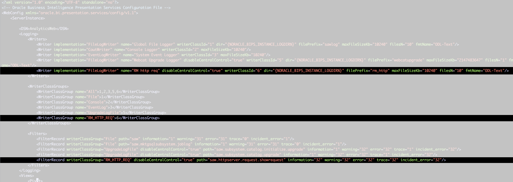
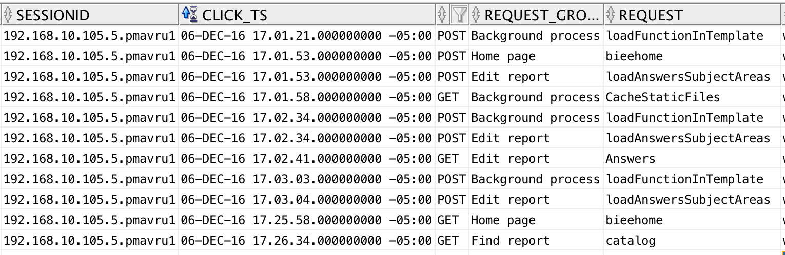
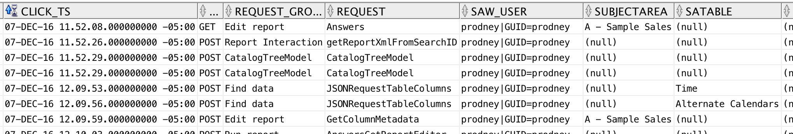

Enhanced Usage Tracking for OBIEE
===

*This is licensed under the MIT license. See license.txt for details.*

## Introduction ##

OBIEE provides [Usage Tracking](https://docs.oracle.com/middleware/12212/biee/BIESG/GUID-9F8FCB4B-EA17-4302-813A-BEF84F295A6A.htm#BIESG211) as part of the core product functionality. It writes directly to a database table every *Logical Query* that hits the BI Server, including details of who ran it, when, and information about how it executed including for how long, how many rows, and so on. This in itself is a veritable goldmine of information about your OBIEE system. All OBIEE deployments should have Usage Tracking enabled, for supporting performance analysis, capacity planning, catalog rationalisation, and more.

What Usage Tracking *doesn't* track is interactions between the end user and the Presentation Services component. Presentation Services sits between the end user and the BI Server from where the actual queries get executed. This means that until a user *executes* an analysis, there's no record of their actions in Usage Tracking. There is this audit data available, but you have to manually enable and collect it, which can be tricky. This is where Enhanced Usage Tracking comes in. It enables the collection and parsing of every click a user makes in OBIEE. For an overview of the potential of this data, see [the article here](https://www.rittmanmead.com/blog/2015/12/driving-obiee-user-engagement-with-enhanced-usage-tracking-for-obiee/) and [here](https://www.rittmanmead.com/blog/2014/11/auditing-obiee-presentation-catalog-activity-with-custom-log-filters/).

Highlights of the data include:

* Which web browsers do people use? Who is accessing OBIEE with a mobile device?

 

 

* Who deleted a catalog object? Who moved it?

 

* What dashboards get exported to Excel most frequently, and by whom?

 

## How to use Enhanced Usage Tracking ##

### Configure Click Event Logging for Presentation Services ###

*N.B. For high-concurrency systems you should test the impact that this increased logging may have on the server*

For a background to Presentation Services logging, see [this article here](https://www.rittmanmead.com/blog/2014/11/auditing-obiee-presentation-catalog-activity-with-custom-log-filters/).

To enable logging at a granular level for HTTP events, do the following:

1. Backup Presentation Services config file

        cp /app/oracle/biee/user_projects/domains/bi/config/fmwconfig/biconfig/OBIPS/instanceconfig.xml /app/oracle/biee/user_projects/domains/bi/config/fmwconfig/biconfig/OBIPS/instanceconfig.xml.bak

2. Amend configuration to interlace following configuration with the `Logging` section.

        <Writer implementation="FileLogWriter" name="RM http req" disableCentralControl="true" writerClassId="6" dir="" filePrefix="rm_http" maxFileSizeKb="10240" filesN="10" fmtName="ODL-Text"/>
        [...]
        <WriterClassGroup name="RM_HTTP_REQ">6</WriterClassGroup>
        [...]
        <FilterRecord writerClassGroup="RM_HTTP_REQ" disableCentralControl="true" path="saw.httpserver.request.showrequest" information="32" warning="32" error="32" trace="32" incident_error="32"/>

    

3. Restart Presentation Services

Now go to OBIEE and signin - you should see the rm_http.log file being written to on every click:

    [oracle@demo logs]$ tail -n20 -f rm_http0.log
    Request params:
    bieehome
    icharset=utf-8
    caj_token=FNSo1JVMhPo
    [[
    File:httpserver.cpp
    Line:351
    Location:
        saw.httpserver.request.showrequest
        saw.httpserver.processrequest
        saw.rpc.server.responder
        saw.rpc.server
        saw.rpc.server.handleConnection
        saw.rpc.server.dispatch
        saw.threadpool.socketrpcserver
        saw.threads
    SessionID: 192.168.10.105.5.pmavru1
    RemoteIP: 192.168.10.105
    SIKey: ssi
    ]]
    [2016-12-06T10:12:49-05:00] [OBIPS] [TRACE:1] [] [saw.httpserver.request.showrequest] [ecid: 42b9c14b-9be8-48cc-8d90-922f5b822c44-00071885,0:1] [tid: 1308186368] [SI-Name: ] [IDD-Name: ] [IDD-GUID: ] [userId: weblogic] Request received.

### Configure and Run Log Parser ###

[Download](https://www.elastic.co/downloads/past-releases/logstash-2-4-1) and install the last release of Logstash 2.4 (this has not been tested with Logstash 5.0)

    wget https://download.elastic.co/logstash/logstash/packages/centos/logstash-2.4.1.noarch.rpm
    sudo rpm -i logstash-2.4.1.noarch.rpm

Clone the github repo:

    cd ~
    git clone https://github.com/RittmanMead/obi-enhanced-usage-tracking.git

Edit the `logstash-obi-clickstream.conf` config file, to set the path :

1. in the **input** stanza for the `rm_http` file generated by Presentation Services
2. in the **output csv** configuration. It's up to you where you write the CSV file. The assumption is that this is `/home/oracle/obi-clickdata` - if using a different path update scripts accordingly.

Run logstash

    /opt/logstash/bin/logstash -f ~/obi-enhanced-usage-tracking/logstash-obi-clickstream.conf

Now go to the path you set in the `output` clause of the logstash configuration file above, and you should see a CSV being written to with events each time you click on something.


Note that you could optionally send this data also to Elasticsearch at this point, simply by adding an additional configuration line in the output stanza.


### Set up Tables in Oracle ###

First, set up the necessary tables in Oracle. Modify the script first to set the credentials and connection details for the database where you want to create the tables:

    ./obi-clickdata-setup.sh

Make sure that you run this from the `obi-enhanced-usage-tracking` folder. This creates a set of tables and views in the `BIEE_BIPLATFORM` schema, as well as a Oracle directory object through which the data is going to be loaded:

    OBI_CLICKDATA_STAGE
    OBI_CLICKDATA_REQUESTGROUP
    OBI_CLICKDATA
    VW_OBI_CLICKDATA_SESS_SUMMARY

### Load Click Data into Oracle ###

Update the `obi-clickdata-incremental-load.sh` script to set the credentials for the BIEE_BIPLATFORM schema. Now run this script to populate the Oracle table with new data since the last script run.

    [oracle@demo obi-enhanced-usage-tracking]$ ./obi-clickdata-incremental-load.sh

    SQL*Plus: Release 12.1.0.2.0 Production on Tue Dec 6 12:26:48 2016

    Copyright (c) 1982, 2014, Oracle.  All rights reserved.

    Last Successful login time: Tue Dec 06 2016 12:25:41 -05:00

    Connected to:
    Oracle Database 12c Enterprise Edition Release 12.1.0.2.0 - 64bit Production
    With the Partitioning, OLAP, Advanced Analytics and Real Application Testing options


    8 rows created.


    Commit complete.

    Disconnected from Oracle Database 12c Enterprise Edition Release 12.1.0.2.0 - 64bit Production
    With the Partitioning, OLAP, Advanced Analytics and Real Application Testing options

You can run this script on demand, write your own schedule wrapper for it - or simply use the Linux `watch` command to invoke it every `x` seconds:

    watch -n 30 ./obi-clickdata-incremental-load.sh

Head over to the `OBI_CLICKDATA` table and you'll see the scraped data:





Using the `TIMESTAMP WITH TIMEZONE` datatype in the `OBI_CLICKDATA` table causes a problem for some software (including the latest version of DV). To get around this, you can create a view with the timestamp simply cast to a standard `TIMESTAMP` datatype. You may need to modify this to cope with the actual timezone that you're working in:

```sql
create view vw_obi_clickdata as
select SESSIONID
    ,CLICK_NUMBER
    ,to_date(to_char(click_ts,'YYYY-MM-DD HH24:MI:SS'),'YYYY-MM-DD HH24:MI:SS') as click_ts
    ,SAW_USER
    ,REQUESTTYPE
    ,REQUEST_GROUP
    ,REQUEST
    ,FOLDER
    ,ITEMNAME
    ,EDITORID
    ,REPORTEDITOR
    ,SUBJECTAREA
    ,SATABLE
    ,ACTION
    ,USERAGENT
    ,MOBILE_IND
    ,COOKIE_ORA_BIPS_NQID
    ,ECID
from obi_clickdata;
```

With this view created you can easily chuck the data into DV and explore it some more:


### Problems? ###

Please raise any issues on the [github issue tracker](https://github.com/RittmanMead/obi-enhanced-usage-tracking/issues). This is open source, so bear in mind that it's no-one's "job" to maintain the code - it's open to the community to use, benefit from, and maintain.

If you'd like specific help with an implementation, Rittman Mead would be delighted to assist - please do [get in touch](https://www.rittmanmead.com/contact/) to discuss our rates.
